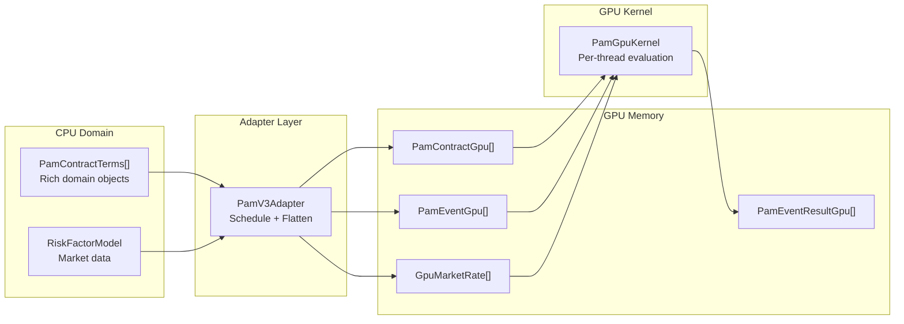
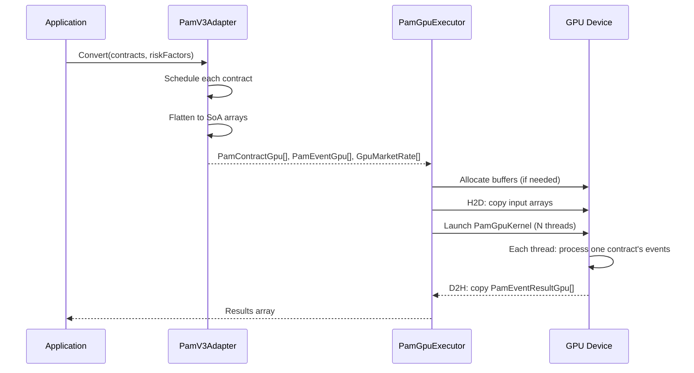
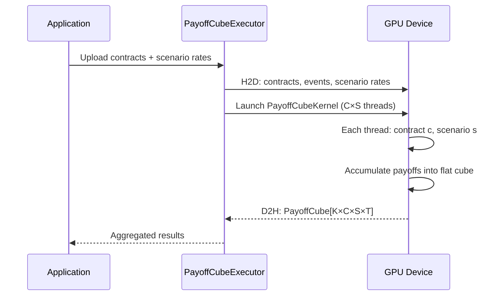

# GPU Architecture

## Overview

The GPU execution pipeline transforms CPU domain objects into flat GPU-compatible structures, runs massively parallel kernels, and returns results. The architecture is organised into three layers: the adapter (data transformation), the kernel (GPU computation), and the executor (orchestration).

## The Three Layers

### Adapter (PamV3Adapter)

The adapter sits between the CPU domain model and the GPU. It performs two jobs: it generates the event schedule for each contract (using the same schedule logic as the CPU engine), and it flattens the results into GPU-compatible flat arrays.

The key transformation is the **event offset strategy**: all contracts' events are packed into a single contiguous array. Each contract record stores an offset and count that point to its events within this shared array. This avoids per-contract memory allocation on the GPU.

| CPU Domain Object | GPU Representation |
|---|---|
| PamContractTerms (rich, with strings, dates, optional fields) | PamContractGpu (fixed-size struct, all numeric, offsets into event array) |
| List of ContractEvent per contract | Single flat PamEventGpu[] with offset/count per contract |
| RiskFactorModel (dictionary lookups) | GpuMarketRate[] flat array with index references |
| DateTime | long (ticks) |
| enum labels ("Annual", "Fixed") | int codes |

### Kernel (PamGpuKernel)

The kernel is a static method that runs on the GPU. Each thread processes one contract by iterating through its events, computing payoffs, and updating state. The kernel implements the same event logic as the CPU engine: IED, IP, IPCI, RR, RRF, FP, SC, MD, PRD, TD, AD, CD.

For Monte Carlo, the PayoffCubeKernel extends this to 2D indexing (contract × scenario), accumulating payoffs into a flat output cube.

### Executor (PamGpuExecutor)

The executor manages the ILGPU context, accelerator selection (CUDA → OpenCL → CPU fallback), buffer allocation, H2D/D2H transfers, and kernel dispatch. It supports two modes:

- **EvaluateBatch** — single-call pipeline: allocate, upload, execute, download, return
- **UploadAndExecute + DownloadResults** — split phases for batching multiple kernel runs before downloading

Buffer pooling ensures that repeated evaluations of similar-sized portfolios incur no GPU memory allocation after the first call.

## Data Flow: Single Evaluation

## Data Flow: Monte Carlo (PayoffCube)

For scenario-based valuation, the kernel operates in 2D:

## Continue Reading

- [Data Structures](./data-structures.md) — blittable structs and SoA layout
- [Kernels](./kernels.md) — PAM kernel, PayoffCube kernel, and Life kernel
- [Executors](./executors.md) — device management, buffer pooling, and profiling
