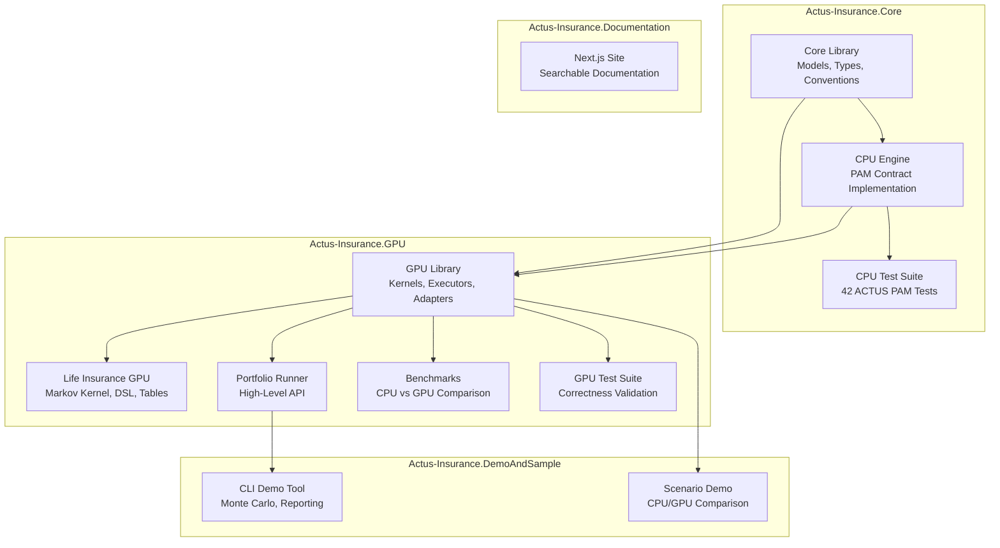

# Technical Documentation

## Overview

This section covers the implementation details of the ACTUS execution engine. It is organized into four areas: the core engine (CPU implementation), GPU acceleration, demonstration tools, and testing.

Each area starts with a conceptual overview and progressively adds implementation detail. Developers who need to understand the codebase, contribute to it, or integrate it into other systems should start here.

## Architecture at a Glance

The system is organized into four repositories, each with a specific responsibility:

## Technology Stack

| Component | Technology | Version |
|---|---|---|
| Runtime | .NET | 9.0 |
| Language | C# | 13 |
| GPU Framework | ILGPU | 1.5.3 |
| Test Framework | NUnit | Latest |
| Benchmark Framework | BenchmarkDotNet | Latest |
| Documentation Site | Next.js | 16.0 |
| Documentation Format | Markdown + Mermaid | — |

## Section Contents

### Core Engine

The heart of the system: contract term models, event generation, state transitions, payoff computation, financial conventions, schedule generation, and market data handling.

- [Core Engine Overview](./core-engine/index.md) — architecture, design principles, and data flow
- [PAM Contract](./core-engine/pam-contract.md) — full PAM implementation: terms, schedule generation, event evaluation, payoff formulas
- [State Machine](./core-engine/state-machine.md) — event processing, state transitions, interest accrual, rate reset algorithm
- [Conventions](./core-engine/conventions/index.md) — day count, business day, end-of-month, and calendar conventions
- [Schedule Generation](./core-engine/scheduling.md) — cycle strings, periodic date sequences, stub handling
- [Risk Factor Model](./core-engine/risk-factors.md) — market data storage, LOCF lookup, usage patterns
- [Technical Reference](./core-engine/reference.md) — complete listing of all types, enumerations, interfaces, and structs

### GPU Acceleration

How the CPU engine was adapted for GPU execution, including data structures, kernels, executors, and memory management.

- [GPU Architecture](./gpu-acceleration/index.md) — overview of the GPU execution pipeline
- [Data Structures](./gpu-acceleration/data-structures.md) — blittable structs and data packing
- [Kernels](./gpu-acceleration/kernels.md) — GPU kernel implementations
- [Executors](./gpu-acceleration/executors.md) — device management and buffer pooling

### Demos & Samples

Demonstration tools and sample applications that show how to use the engine.

- [CLI Tool](./demos-and-samples/cli-tool/index.md) — Monte Carlo portfolio valuation CLI
- [Scenario Demo](./demos-and-samples/scenario-demo.md) — CPU vs GPU comparison tool

### Testing

Test strategy, test data, and how to run the test suites.

- [Testing Overview](./testing/index.md) — test architecture and validation approach
- [Running Tests](./testing/running-tests.md) — how to execute the test suites
