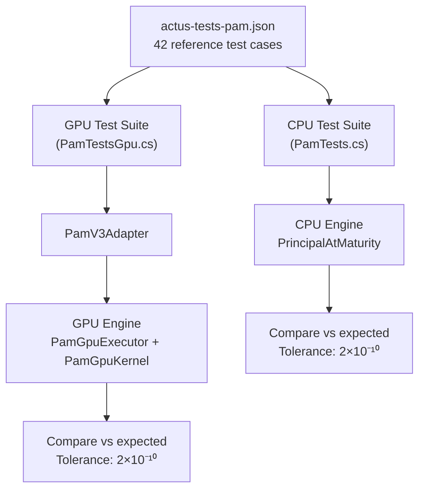

# Testing Overview

## Philosophy

The testing strategy is built on one principle: **every layer of the system must produce results identical to the ACTUS reference, to within 10 decimal places.** This is verified by running the 42 official ACTUS PAM reference test cases on every execution engine (CPU and GPU) and comparing every event's payoff and state values against the certified expected results.

## The 42 Reference Tests

ACTUS publishes a comprehensive set of reference test cases for each contract type. For PAM, there are 42 tests covering:

- Fixed and floating interest rates
- Monthly, quarterly, semi-annual, and annual payment frequencies
- Different day count conventions (A/365, A/360, 30E/360, A/A ISDA)
- Business day conventions (various shift/calc combinations)
- Rate resets with caps, floors, and spread adjustments
- Fee structures (absolute and notional-based)
- Scaling adjustments
- Purchase and termination events
- Edge cases (same-day events, end-of-month handling)

Each test case defines: contract terms, observed market data (rate observations), and expected results (event date, type, payoff, and state values for every event).

## Test Architecture

## CPU Test Suite (PamTests.cs)

The CPU test suite loads the JSON test file, parses each test case into contract terms and risk factors, generates the event schedule, applies all events, and compares the computed payoff and state values against expected results.

The tolerance is 2×10⁻¹⁰ (two ten-billionths). This is tight enough to catch subtle calculation errors while accommodating the inherent limits of double-precision floating-point arithmetic.

## GPU Test Suite (PamTestsGpu.cs)

The GPU test suite follows the same pattern but routes through the adapter and GPU executor:

1. Parse the same JSON test cases
2. Convert contract terms to GPU format via PamV3Adapter
3. Execute on the GPU via PamGpuExecutor
4. Filter results (exclude pre-purchase events to match reference expectations)
5. Compare against the same expected values with the same tolerance

This ensures that every transformation step (domain → GPU struct → kernel computation → result struct) preserves correctness.

## Life Insurance Tests

The life insurance GPU tests verify:

- Projection output shape (correct number of time steps and channels)
- Probability conservation (probActive + probDeath + probLapsed ≤ 1.0)
- Deterministic reproducibility (same inputs produce same outputs)
- Edge cases (zero premium, immediate lapse, extreme ages)

## Continuous Verification

The project enforces a "re-certify after every change" discipline: after any modification to the engine, adapter, or kernel, all 42 reference tests are re-run. Any change that causes even one test to fail — by even a fraction above the tolerance — is rejected until the root cause is fixed. This means the system is never in an incorrect state.
